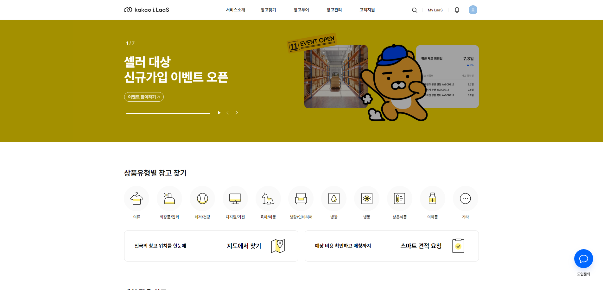
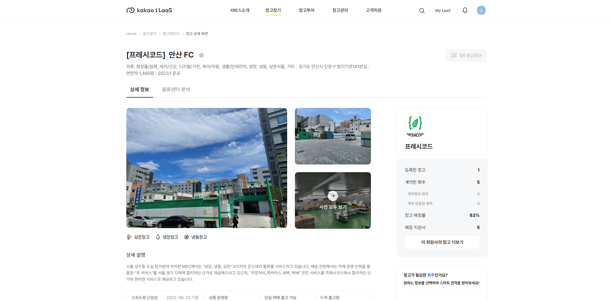

# Profile

 

<i>Always study, I wanna be a pro</i>

<i>Just do it and bring passion</i>

 

<h3 align="center">🛠 Tech Stack 🛠</h3>

  </a>&nbsp 
  </a>&nbsp 
  </a>&nbsp
  </a>&nbsp
  </a>&nbsp
  </a>&nbsp
  </a>&nbsp
  </a>&nbsp
  </a>&nbsp 
  </a>&nbsp
  </a>&nbsp
  </a>&nbsp
  </a>&nbsp
  </a>&nbsp
  </a>&nbsp  

  

# **소개**

기록 및 정리를 습관화하기위해 노력하는 김현준입니다.
  
iNavi Systems 에서 GPS 기반 다양한 지도 도메인 웹 서비스 및 API 개발을 경험하였고, FMS (Fleet Management System) 서비스의 클라이언트 개발을 주도적으로 진행하면서 본격적인 FE 개발의 시작점이 되었습니다.
  
DK Techin 에서 Kakao i LaaS 창고 매칭 서비스 클라이언트 리뉴얼을 담당하였습니다.
 
3개월 남짓 짧은 시간이었지만 Kakao 내부 플랫폼과 서비스 및 클라우드 환경을 경험해볼 수 있었고, Vue, Nuxt 기반 SPA 도 프로젝트에서 처음 적용해보면서 FE 개발에 더 방향성을 잡게 된 계기가 된 것 같습니다.
  
현재 TMAP Mobility 에서 지도 서비스 배포 및 전반적인 인프라 운영, 자사 지도 생성을 위한 웹 관리 서비스의 개발을 담당하며 도메인 지식 및 개발 역량을 강화중에 있습니다.
 
TMAP App 이 Vertical 서비스로 변모하면서 그에 맞는 지도 서비스를 제공하고자 노력하고 있습니다.
  
개발 방향성을 잡기 이전의 기본기를 탄탄히 하고자 FE, BE, Server, Infra 등 다양한 기술 스택을 쌓았습니다.
  
다양한 기술 스택을 토대로 각 분야의 담당자들과 소통하며 업무에 임하고있으며, 지도 도메인을 중점으로 더 나은 Software Engineer 가 되기위해 노력하고 있습니다.
  
감사합니다.
  

***
 

# **경력**

 

- iNavi Systems
  + 2019.08 ~ 2022.06
  + 소속 : 전략 POC 그룹 응용기술개발팀
  + 담당 : 지도기술 연구 담당 | 지도 FE 개발

 

- DK Techin
  + 2022.09 ~ 2022.12
  + 소속 : SI 사업부문 물류서비스개발팀
  + 담당 : 물류 매칭 서비스 FE 개발

 

- TMAP Mobility
  + 2023.01 ~ 재직중
  + 소속 : 맵플랫폼 맵인프라팀
  + 담당 : 지도기술 연구 | 지도 FE 개발

 

***
 

# **프로젝트**

 

> ## iNavi Maps API Guide

- 사이트 : [iNavi Maps API 가이드](http://www.inavi.kr/api_web/)
- 기간 : 2019.11 ~ 2020.03
- 설명 : iNavi Maps API 이용 안내 서비스
- 역할 : 지도 API 직접 해보기 기능 구현
- 사용 기술 : Vanilla JS, HTML, IIS

 

> ## iNavi Maps API

- 참고 사이트 : [Mapbox](https://www.mapbox.com/)
- 기간 : 2020.03 ~ 2020.06
- 설명 : iNavi Maps API 서비스
- 역할 : 지도 API 개선
- 사용 기술 : Vanilla JS, Node

 

> ## iNavi Connected Admin

- 기간 : 2020.06 ~ 2020.09
- 설명 : 블랙박스 단말 관리를 위한 관리자용 Admin
- 역할 : 신규 메뉴 개발, 운영
- 사용 기술 : JQuery, Vanilla JS, Java, AWS

 

> ## FMS (Fleet Management System)

- 사이트 : [국내 FMS 관제 서비스](http://fms.inavisys.com/) / [해외 FMS 관제 서비스](https://www.thinkwareconnected.com/)
- 기간 : 2020.10 ~ 2022.06
- 설명 : [국내 / 해외] 블랙박스 단말 기반 실시간 차량 위치 제공 서비스
- 역할 : 프로젝트 설계, 개발, 배포, 운영
- 사용 기술 : Spring Boot, Java, Vanilla JS, AWS, IDC, Google Analytics

 

> ## Kakao i LaaS Matching 서비스

- 사이트 : [Kakao i LaaS Matching](https://kakaoilaas.com/?utm_source=google_pc&tum_medium=sa&utm_campaign=kakaoilaas&utm_term=laas&gclid=CjwKCAiAmuKbBhA2EiwAxQnt7z4cN4BIDDHQNVK5VerzfWIxS1J-oqHt0_zxYBpQz8YGyoFWJ8X0KRoCcaEQAvD_BwE)
- 기간 : 2022.09 ~ 2022.12
- 설명 : 회원사와 화주 간 물류 창고 사용을 위한 매칭 서비스
- 역할 : 프로젝트 리뉴얼
- 사용 기술 : Vue, Nuxt

 

> ## VSM Admin

- 기간 : 2023.01 ~ 진행중
- 설명 : 지도 타일 (레이어) 생성, SDK config 배포하기 위한 Admin
- 역할 : SDK config 관리/배포, 추가기능 개발
- 사용 기술 : Spring Boot, Kotlin, Angular, Docker, AWS

 

