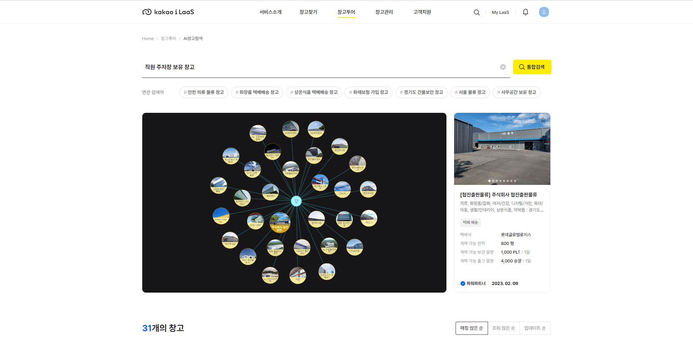

# Profile

 

<i>Always study, I wanna be a pro</i>

<i>Just do it and bring passion</i>

 

<h3 align="center">🛠 Tech Stack 🛠</h3>

  </a>&nbsp 
  </a>&nbsp 
  </a>&nbsp
  </a>&nbsp
  </a>&nbsp
  </a>&nbsp
  </a>&nbsp
  </a>&nbsp 
  </a>&nbsp
  </a>&nbsp
  </a>&nbsp
  </a>&nbsp
  </a>&nbsp
  </a>&nbsp  

  

# **소개**

안녕하세요. 정리하는 것을 좋아하는 웹 개발자 김현준입니다. 
  
iNavi Systems 에서 Spring 기반 Java 와 Vanilla JS 로 FMS (Fleet Management System) 서비스의 클라이언트 개발 부분을 담당하였습니다.
 
지도가 메인 도메인인 회사여서 GPS 기반의 다양한 웹 서비스 및 API 를 경험해 볼 수 있었고 현재 개발하는데 있어서 좋은 시작점이 되었습니다.
  
DK Techin 에서 Vue, Nuxt 로 Kakao i LaaS 창고 매칭 서비스 리뉴얼, 운영을 담당하였습니다.
 
비록 짧은 시간이었지만 카카오에서 사용하는 여러 플랫폼과 클라우드를 경험해볼 수 있었고, SPA 도 처음 현업에 적용해보면서 프론트엔드 개발에 더 방향성을 잡게 된 계기가 된 것 같습니다.
  
현재는 TMAP Mobility 에서 지도 인프라 관련 정기 지도 서비스 배포 및 지도를 구성하고 있는 배경, 주기 생성을 위한 지도 관리자 웹 서비스의 개발을 담당하고 있습니다.
 
네비게이션 업계 1등이라는 타이틀에 걸맞는 지도 서비스를 제공하고자 노력하고 있습니다.
  
첫 회사에서 풀스택을 경험하며 개발 방향성을 잡기 이전의 기본기를 탄탄히 하고자 노력하였고, 이후 프론트엔드로 방향성을 잡고 성장하기 위해 TypeScript 와 React, Vue 를 이용한 사이드 프로젝트 및 개인 공부를 병행하였습니다.
  
빠르게 변화하는 프론트엔드 생태계에 발맞춰 성장하고 싶으며 사용자들에게 일상의 즐거움, 삶의 변화를 줄 수 있는 서비스를 만드는 개발자가 되고 싶습니다.
  
감사합니다.
  

***
 

# **경력**

 

- iNavi Systems
  + 2019.08 ~ 2022.06
  + 소속 : 전략 POC 그룹 응용기술개발팀
  + 담당 : 지도기술 연구 담당 | 프론트엔드 개발

 

- DK Techin
  + 2022.09 ~ 2022.12
  + 소속 : SI 사업부문 물류서비스개발팀
  + 담당 : 물류 매칭 서비스 프론트엔드 개발

 

- TMAP Mobility
  + 2023.01 ~ 재직중
  + 소속 : 맵플랫폼 맵인프라팀
  + 담당 : 지도 서비스 배포 서버 운영 및 지도 정기 업데이트 | 프론트엔드 개발

 

***
 

# **프로젝트**

 

> ## iNavi Maps API Guide

- 사이트 : [iNavi Maps API 가이드](http://imapsapi.inavi.com/guide.html)
- 기간 : 2019.11 ~ 2020.03
- 설명 : iNavi Maps API 이용 안내 서비스
- 역할 : 지도 API 직접 해보기 기능 구현
- 사용 기술 : Vanilla JS, HTML, IIS

 

> ## iNavi Maps API

- 참고 사이트 : [Mapbox](https://www.mapbox.com/)
- 기간 : 2020.03 ~ 2020.06
- 설명 : iNavi Maps API 서비스
- 역할 : 지도 API 개선
- 사용 기술 : Vanilla JS, Node

 

> ## iNavi Connected Admin

- 기간 : 2020.06 ~ 2020.09
- 설명 : 블랙박스 단말 관리를 위한 관리자용 Admin 백오피스
- 역할 : 신규 메뉴 개발, 운영
- 사용 기술 : JQuery, Vanilla JS, Java, AWS

 

> ## FMS 관제 서비스

- 사이트 : [국내 FMS 관제 서비스](http://fms.inavisys.com/) / [해외 FMS 관제 서비스](https://www.thinkwareconnected.com/)
- 기간 : 2020.10 ~ 2022.06
- 설명 : [국내/해외] 블랙박스 단말 기반 실시간 차량 위치 제공 서비스
- 역할 : 프로젝트 설계, 개발, 배포, 운영
- 사용 기술 : Spring Boot, Java, Vanilla JS, AWS, IDC, Google Analytics

 

> ## Kakao i LaaS Matching 서비스

- 사이트 : [Kakao i LaaS Matching](https://kakaoilaas.com/?utm_source=google_pc&tum_medium=sa&utm_campaign=kakaoilaas&utm_term=laas&gclid=CjwKCAiAmuKbBhA2EiwAxQnt7z4cN4BIDDHQNVK5VerzfWIxS1J-oqHt0_zxYBpQz8YGyoFWJ8X0KRoCcaEQAvD_BwE)
- 기간 : 2022.09 ~ 2022.12
- 설명 : 회원사와 화주 간 물류 창고 사용을 위한 매칭 서비스
- 역할 : 프로젝트 리뉴얼
- 사용 기술 : Vue, Nuxt

 

> ## VSM Admin

- 기간 : 2023.01 ~ 진행중
- 설명 : 지도를 구성하는 배경, 주기와 같은 것들을 생성하고 배포하기 위한 지도 생성 Admin 백오피스
- 역할 : 지도 config 관리 및 지도 서비스 배포, 프로젝트 개선
- 사용 기술 : Spring Boot, Angular, Kotlin, AWS, IDC

 

